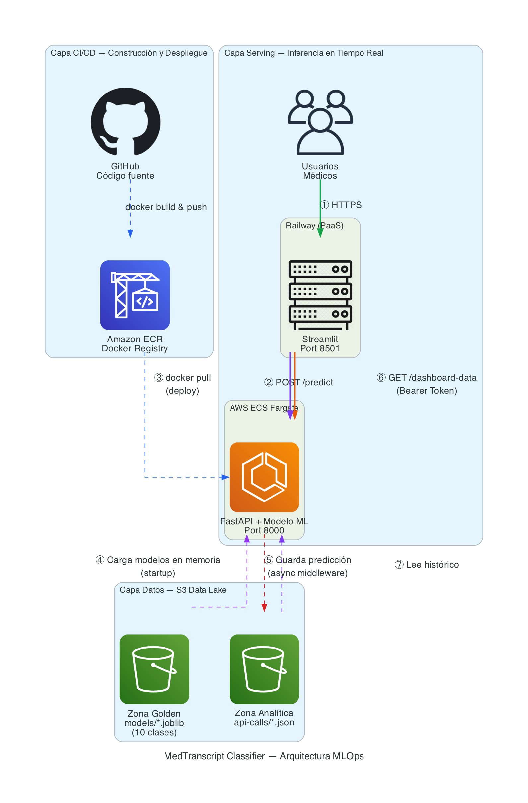

# Secciones para el Reporte Final (Entrega 3)

---

## 1. Cambios Arquitectónicos frente a la Entrega 2

En la Entrega 2, el modelo y la API corrían en entornos locales o instancias estáticas (EC2), y los datos se almacenaban sin una segregación clara entre producción y experimentación. Para esta Entrega 3, la arquitectura evolucionó hacia un modelo **Cloud-Native y Serverless**:
1. **Despliegue Serverless:** Transición de entornos manuales a contenedores Docker gestionados automáticamente por AWS ECS Fargate.
2. **Data Lake Estructurado:** Migración del almacenamiento local de datos a un esquema de zonas (Golden y Analítica) en Amazon S3, unificando el control de versiones (DVC) y el monitoreo de ML.
3. **Separación Frontend/Backend:** El frontend (Streamlit) se despliega de forma independiente en **Railway**, mientras el backend (FastAPI + modelo ML) opera en AWS. Ambos se comunican vía HTTP con autenticación por token.

---

## 2. Justificación del Servicio Cloud: AWS ECS (Fargate)

Evaluamos EKS, EC2 y ECS (Fargate) para desplegar la API. Elegimos **ECS con Fargate** por tres razones clave:

1. **Baja Complejidad Operativa:** Fargate elimina la necesidad de gestionar servidores subyacentes (parches, OS). EKS era desproporcionadamente complejo (gestión de clústeres Kubernetes) para las necesidades actuales del prototipo.
2. **Eficiencia en Costos:** EC2 cobra por hora encendida y EKS tiene un costo base mensual elevado ($73 USD). Fargate sigue un modelo *pay-as-you-go*, cobrando estrictamente por los recursos (CPU/RAM) consumidos durante la ejecución del contenedor.
3. **Escalabilidad y Ecosistema:** Integración nativa sin fricción con servicios de MLOps de AWS (ECR, S3, CloudWatch) mediante IAM Task Roles, facilitando el escalamiento automático en picos de demanda.

Para el **frontend (Streamlit)**, se eligió **Railway** por su simplicidad de despliegue desde GitHub, soporte nativo de Dockerfiles, y gestión de variables de entorno para secretos (tokens, URLs).

---

## 3. Arquitectura de Datos: S3 Data Lake y DVC

Implementamos un bucket unificado en Amazon S3 (`mlops-medical-project-uniandes-2026`) bajo el estándar de *Medallion Architecture*, dividido en dos zonas estrictas:

- **Zona Golden (`/golden`):** Entorno inmutable y de solo lectura para la API. Almacena el dataset curado y los modelos entrenados (`.joblib`). Se controla explícitamente usando **DVC**.
- **Zona Analítica (`/analytics`):** Entorno de escritura. Un middleware en la API intercepta asíncronamente cada request HTTP y guarda la entrada del usuario junto con la predicción del modelo en formato JSON para futuro monitoreo de *Data Drift*.

**Acceso Downstream para el Dashboard (Streaming de Históricos):**
Para desacoplar el frontend del almacenamiento subyacente y proteger las credenciales de AWS, se expone un endpoint dedicado en la API (`GET /dashboard-data`). Este endpoint funciona como un puente: lee los registros históricos en la Zona Analítica, los consolida y los retorna al Frontend en un formato JSON estructurado. Está protegido por autenticación Bearer Token.

### Diagrama de Flujo MLOps

La arquitectura sigue el patrón **API Gateway** con almacenamiento desacoplado:

1. **Usuarios / Médicos** → acceden al frontend Streamlit desplegado en Railway.
2. **Streamlit (Railway)** → envía `POST /predict` y `GET /dashboard-data` al backend FastAPI en AWS.
3. **FastAPI (ECS Fargate)** → al arrancar, descarga los modelos de la Zona Golden de S3. Cada predicción se registra automáticamente en la Zona Analítica.
4. **Amazon ECR** → almacena la imagen Docker del backend. ECS la descarga al iniciar un nuevo task.

---

## 4. Corrección del Pipeline de Entrenamiento

### Problema Detectado

Al analizar los logs de producción vía `/dashboard-data`, se identificó que las predicciones presentaban confianzas anormalmente bajas (~24-33%) y solo clasificaban en **5 especialidades** en lugar de las 10 documentadas en el notebook de modelado.

**Causa raíz:** El script `train.py` ejecutaba 3 experimentos secuencialmente, cada uno sobrescribiendo los mismos archivos `.joblib`. El Experimento 2 (`min_samples=100`) filtraba a solo 5 especialidades, y el Experimento 3 cambiaba `C=0.1`, generando un modelo más conservador.

### Solución Implementada

Se refactorizó `train.py` para aislar los experimentos del modelo de producción:

- Cada experimento ahora guarda sus artefactos en una subcarpeta independiente (`models/experiments/<nombre>/`).
- Una función `train_production_model()` entrena y guarda el modelo final en la raíz `models/`, que es lo que la API usa.
- **Configuración de producción:** `min_samples=50` (10 clases), `C=1.0`, `xgb_depth=6`.

**Resultado:** El modelo de producción clasifica en **10 especialidades** con Accuracy **89.8%** y F1 Macro **0.82**.

---

## 5. Probabilidades Independientes (Sigmoid vs Softmax)

### Problema con Softmax

El enfoque original usaba `predict_proba()`, que aplica **softmax** forzando a que las probabilidades sumen 100%. Con 10 clases, esto distorsionaba la interpretación: una transcripción claramente radiológica mostraba solo ~16.7% de confianza.

### Solución: Sigmoid Independiente

Se cambió `predict.py` para usar la función **sigmoid** aplicada a las puntuaciones crudas (`decision_function`) de cada clase de forma independiente. Cada clase responde a: *"¿Qué tan probable es que esta transcripción pertenezca a esta especialidad?"*

| Transcripción | Antes (Softmax) | Después (Sigmoid) |
|---|---|---|
| CT scan abdominal + masa renal | Radiology 16.7% | Radiology **81.4%** |
| Fractura tibia + fijación interna | Surgery 14.2% | Surgery **71.9%** |
| Dolor torácico + elevación ST | SOAP/Notes 10.1% | SOAP/Notes **66.2%** |

### Justificación Técnica

1. **Interpretabilidad clínica:** Una transcripción médica puede ser relevante para múltiples especialidades simultáneamente. Las probabilidades independientes reflejan esta realidad.
2. **Consistencia con el rendimiento real:** El modelo tiene un accuracy del 89.8%, pero softmax forzaba confianzas artificialmente bajas. Sigmoid refleja mejor la certeza real.
3. **Compatibilidad:** Se mantiene `predict_proba()` como fallback para modelos sin `decision_function` (e.g., XGBoost).

---

## 6. Frontend: Dashboard de Monitoreo

Se implementó una pestaña **📈 Analytics** en el frontend Streamlit que consume datos reales del endpoint `/dashboard-data`. Incluye:

- **KPIs en tiempo real:** Total de predicciones, confianza promedio, tiempo de respuesta promedio, especialidades únicas.
- **Distribución de especialidades:** Gráfico de dona con la frecuencia de cada especialidad predicha.
- **Distribución de confianza:** Histograma con la distribución de probabilidades sigmoid del modelo.
- **Confianza por especialidad:** Barras horizontales con la confianza promedio desglosada.
- **Tiempo de respuesta:** Scatter plot temporal para monitorear latencia de la API.
- **Tabla de registros:** Log detallado de cada predicción con fecha, especialidad, confianza y fragmento de la transcripción.

La versión del modelo (`v3.0-sigmoid-10classes`) se muestra como badge en la barra de navegación para trazabilidad.
