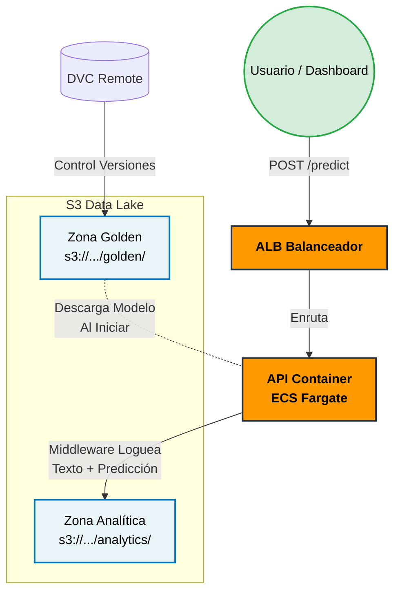

# Secciones para el Reporte Final (Entrega 3)

---

## 1. Cambios Arquitectónicos frente a la Entrega 2

En la Entrega 2, el modelo y la API corrían en entornos locales o instancias estáticas (EC2), y los datos se almacenaban sin una segregación clara entre producción y experimentación. Para esta Entrega 3, la arquitectura evolucionó hacia un modelo **Cloud-Native y Serverless**:
1. **Despliegue Serverless:** Transición de entornos manuales a contenedores Docker gestionados automáticamente por AWS ECS Fargate.
2. **Data Lake Estructurado:** Migración del almacenamiento local de datos a un esquema de zonas (Golden y Analítica) en Amazon S3, unificando el control de versiones (DVC) y el monitoreo de ML.

---

## 2. Justificación del Servicio Cloud: AWS ECS (Fargate)

Evaluamos EKS, EC2 y ECS (Fargate) para desplegar la API. Elegimos **ECS con Fargate** por tres razones clave:

1. **Baja Complejidad Operativa:** Fargate elimina la necesidad de gestionar servidores subyacentes (parches, OS). EKS era desproporcionadamente complejo (gestión de clústeres Kubernetes) para las necesidades actuales del prototipo.
2. **Eficiencia en Costos:** EC2 cobra por hora encendida y EKS tiene un costo base mensual elevado ($73 USD). Fargate sigue un modelo *pay-as-you-go*, cobrando estrictamente por los recursos (CPU/RAM) consumidos durante la ejecución del contenedor.
3. **Escalabilidad y Ecosistema:** Integración nativa sin fricción con servicios de MLOps de AWS (ECR, S3, CloudWatch) mediante IAM Task Roles, facilitando el escalamiento automático en picos de demanda.

---

## 3. Arquitectura de Datos: S3 Data Lake y DVC

Implementamos un bucket unificado en Amazon S3 (`mlops-medical-project-uniandes-2026`) bajo el estándar de *Medallion Architecture*, dividido en dos zonas estrictas:

- **Zona Golden (`/golden`):** Entorno inmutable y de solo lectura para la API. Almacena el dataset curado y los modelos entrenados (`.joblib`). Se controla explícitamente usando **DVC**.
- **Zona Analítica (`/analytics`):** Entorno de escritura. Un middleware en la API intercepta asíncronamente cada request HTTP y guarda la entrada del usuario junto con la predicción del modelo en formato JSON para futuro monitoreo de *Data Drift*.

**Acceso Downstream para el Dashboard (Streaming de Históricos):**
Para desacoplar el frontend del almacenamiento subyacente y proteger las credenciales de AWS, se expone un endpoint dedicado en la API (`GET /dashboard-data`). En lugar de que Streamlit consulte S3 directamente, este endpoint funciona como un puente: lee los registros históricos en la Zona Analítica, los consolida y los retorna al Dashboard en un formato estructurado y unificado.

El endpoint está protegido por Autenticación Simple. El dashboard debe enviar:
`Headers: { "Authorization": "Bearer <API_SECRET_KEY>" }`

*(Opcional) Guardar `API_SECRET_KEY=academic_mlops_secret` en los secrets de Streamlit.*

**Estructura de la Respuesta (`/dashboard-data`):**
Devuelve un JSON con una lista consolidada `data` que contiene el histórico de predicciones. Cada elemento respeta el esquema `ApiCallLog`:

```json
{
  "data": [
    {
      "request_id": "b57e067c-cb6e-40c6...",
      "timestamp": "2026-03-06T06:35:55.072Z",
      "method": "POST",
      "path": "/predict",
      "request_body": "{\"transcription\": \"Patient presents with chest pain...\"}",
      "response_body": "{\"specialty\":\"Cardiology\",\"confidence\":0.85...}",
      "status_code": 200,
      "response_time_ms": 4.52
    }
  ]
}
```
*Con esta estructura, el frontend puede deserializar fácilmente `request_body` y `response_body` usando `pandas.json_normalize()` para graficar uso de modelos, confianzas promedio y distribuciones de especialidades.*

### Diagrama de Flujo (Mermaid)


